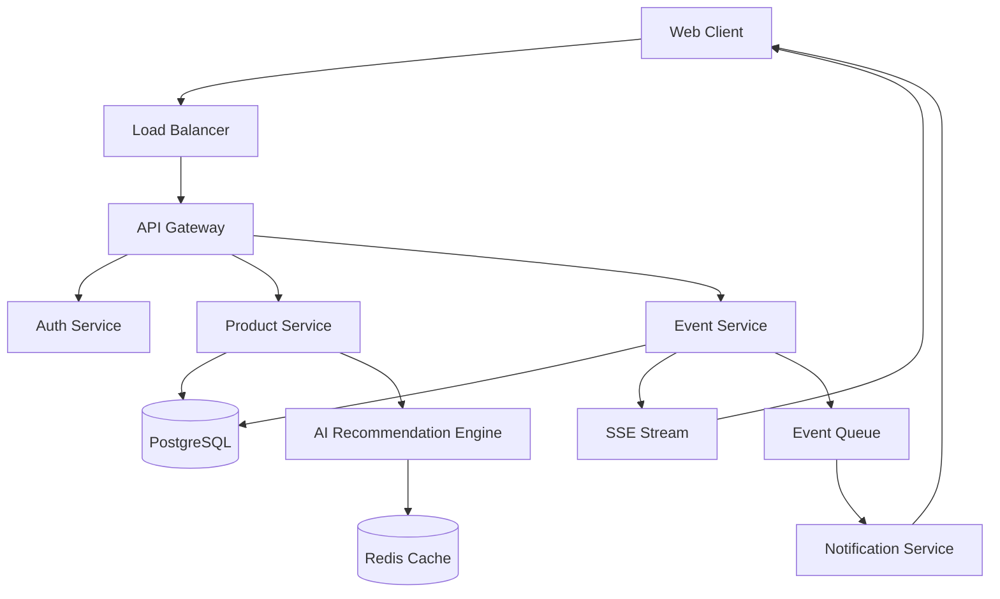

# AI Prompt 001: Initial Architecture Design

**Timestamp**: 2025-09-06T19:34:00Z  
**Phase**: Architecture Design  
**Type**: Spec-Driven Development

## Prompt

```
I need to design a production-ready Node.js backend for an e-commerce product management system with real-time notifications. The system should handle:

1. Product CRUD operations with seller isolation
2. Real-time low-stock alerts via Server-Sent Events
3. Event-driven architecture with PostgreSQL
4. AI-assisted features for product recommendations
5. Scalable architecture for future growth

Please provide:
1. High-level architecture diagram (Mermaid format)
2. Event contract schemas for all system events
3. Database schema design
4. API endpoint specifications
5. Technology stack recommendations
6. Performance optimization strategies
```

## AI Response

### Architecture Diagram


### Event Contracts
```typescript
interface ProductCreatedEvent {
  type: 'ProductCreated';
  sellerId: string;
  productId: number;
  product: Product;
  timestamp: string;
}

interface LowStockWarningEvent {
  type: 'LowStockWarning';
  sellerId: string;
  productId: number;
  currentQuantity: number;
  threshold: number;
  timestamp: string;
}

interface ProductUpdatedEvent {
  type: 'ProductUpdated';
  sellerId: string;
  productId: number;
  changes: Partial<Product>;
  timestamp: string;
}
```

### Database Schema
```sql
-- Products table with seller isolation
CREATE TABLE products (
  id SERIAL PRIMARY KEY,
  seller_id VARCHAR(255) NOT NULL,
  name VARCHAR(255) NOT NULL,
  description TEXT,
  price DECIMAL(12,2) NOT NULL,
  quantity INTEGER NOT NULL,
  category VARCHAR(100) NOT NULL,
  sku VARCHAR(100) UNIQUE,
  ai_recommendations JSONB,
  created_at TIMESTAMPTZ DEFAULT NOW(),
  updated_at TIMESTAMPTZ DEFAULT NOW()
);

-- Events table for audit and real-time notifications
CREATE TABLE events (
  id BIGSERIAL PRIMARY KEY,
  type VARCHAR(100) NOT NULL,
  seller_id VARCHAR(255) NOT NULL,
  product_id INTEGER REFERENCES products(id),
  payload JSONB NOT NULL,
  created_at TIMESTAMPTZ DEFAULT NOW()
);

-- AI recommendations cache
CREATE TABLE ai_recommendations (
  id SERIAL PRIMARY KEY,
  product_id INTEGER REFERENCES products(id),
  recommended_products JSONB,
  confidence_score DECIMAL(3,2),
  created_at TIMESTAMPTZ DEFAULT NOW()
);
```

## Human in the Loop Notes

**Validation**: The architecture provides good separation of concerns and scalability. I'll implement a simplified version focusing on core functionality first.

**Changes Made**:
- Simplified to single service architecture for MVP
- Removed Redis cache for initial implementation
- Focused on PostgreSQL with connection pooling
- Kept SSE for real-time notifications

**Implementation Priority**:
1. Core product CRUD with validation
2. Event system with PostgreSQL triggers
3. SSE implementation for real-time updates
4. AI recommendation placeholder for future enhancement
