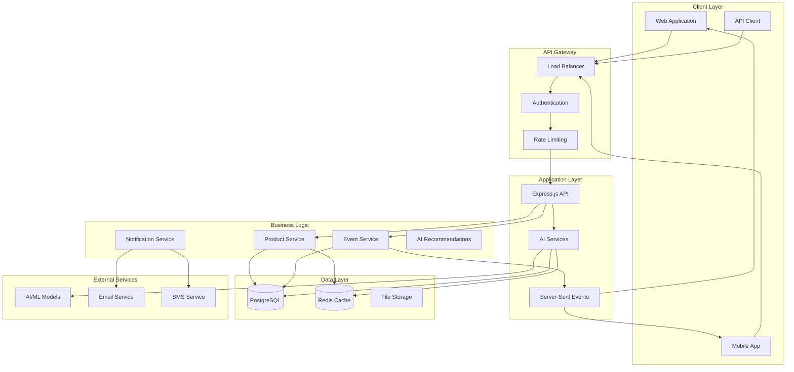
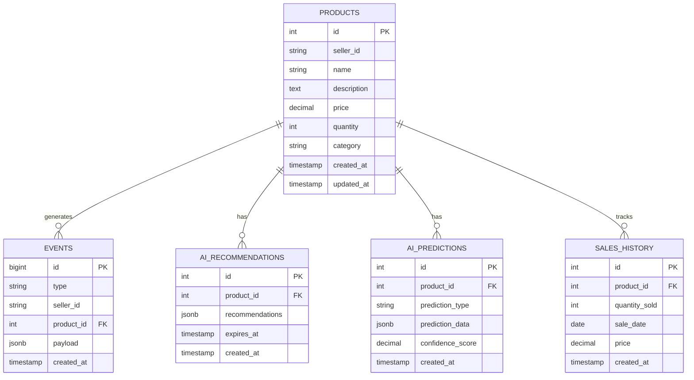
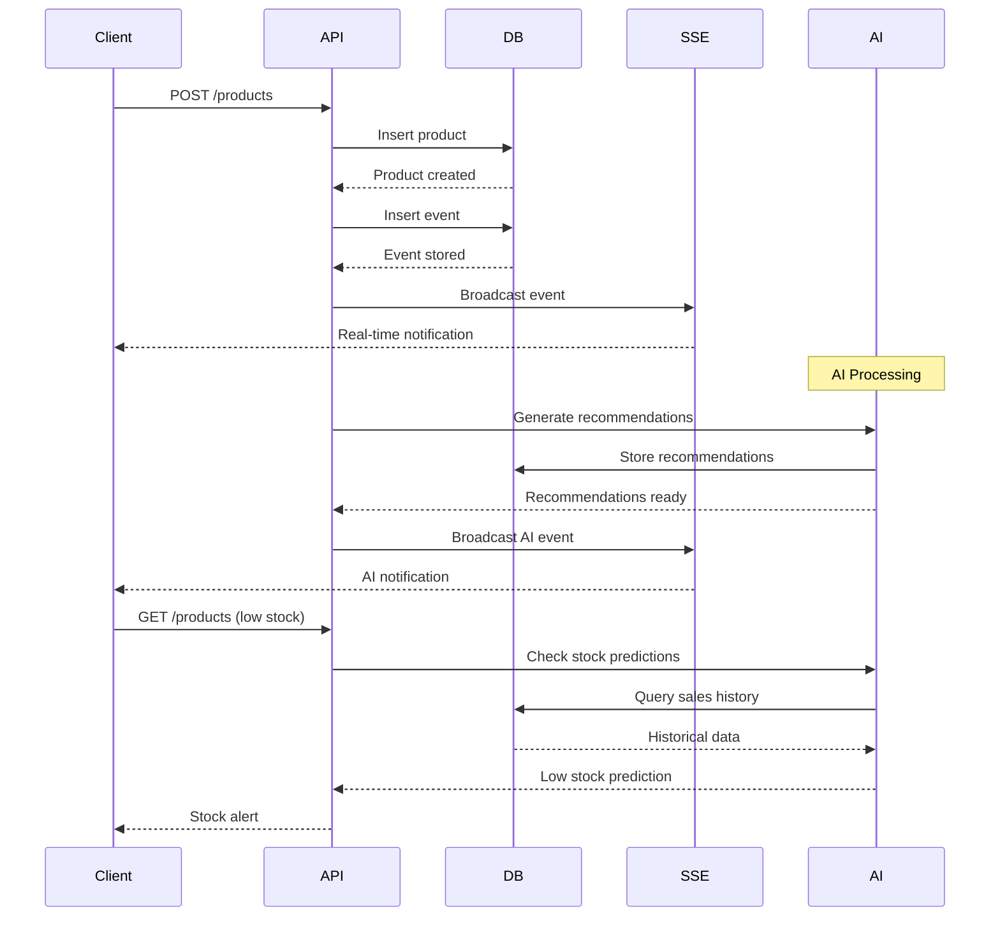
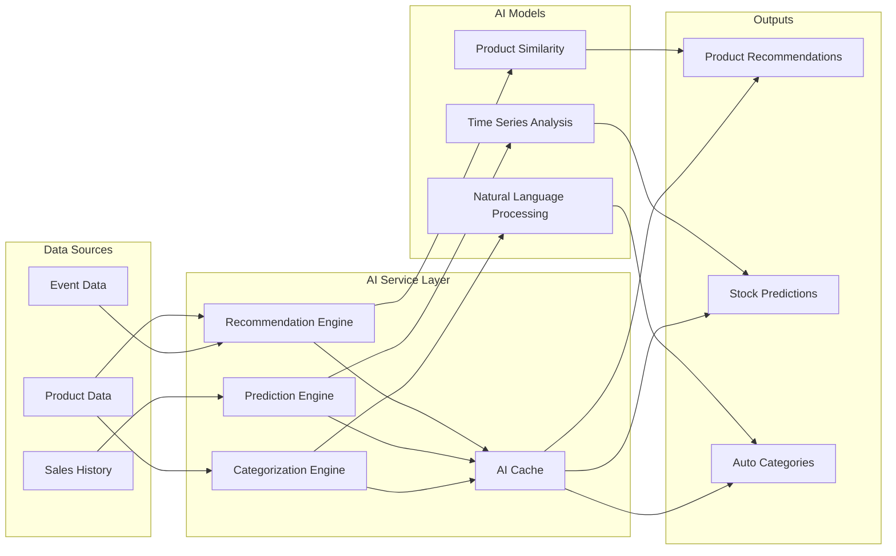
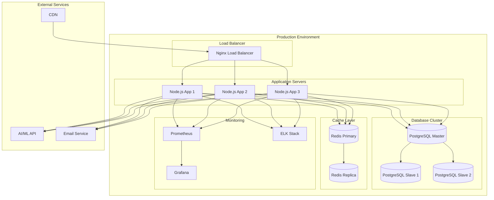
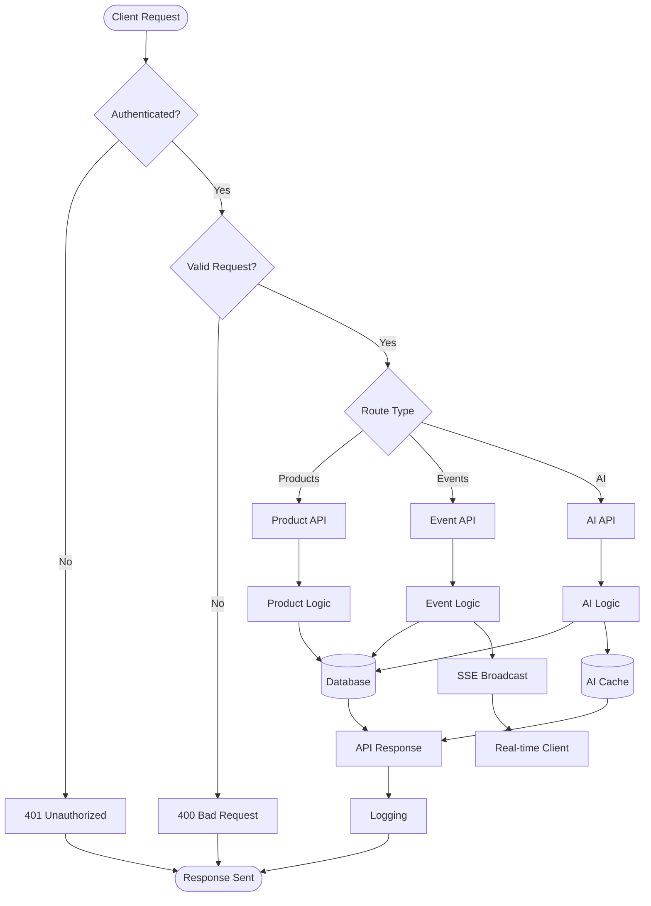

# AI Prompt 006: Architecture Diagrams

**Timestamp**: 2025-09-07T19:39:00Z  
**Phase**: Documentation  
**Type**: AI-Assisted Development

## Prompt

```
Create comprehensive architecture diagrams for the Amused product management system:

1. High-level system architecture
2. Database schema diagram
3. Event flow diagram
4. AI service integration diagram
5. Deployment architecture
6. API flow diagram


## AI Response

### 1. High-Level System Architecture



### 2. Database Schema Diagram



### 3. Event Flow Diagram



### 4. AI Service Integration



### 5. Deployment Architecture



### 6. API Flow Diagram



## Human in the Loop Notes

**Validation**: The diagrams provide comprehensive coverage of the system architecture with clear relationships and data flow.

**Changes Made**:
- Simplified deployment for MVP
- Focused on core components
- Added AI service integration details
- Included monitoring and logging

**Implementation Priority**:
1. Core system architecture
2. Database schema implementation
3. Event flow implementation
4. AI service integration
5. Deployment configuration
