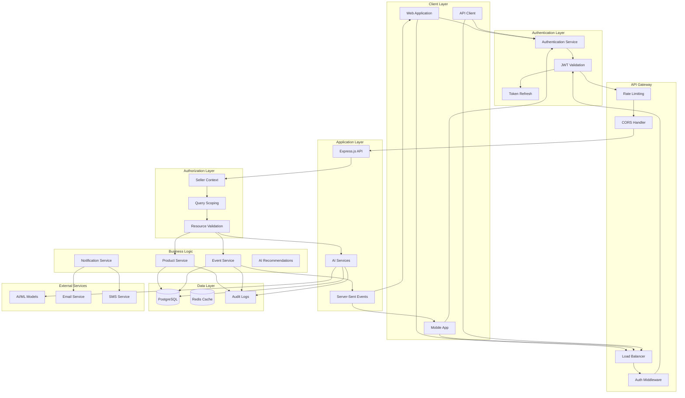
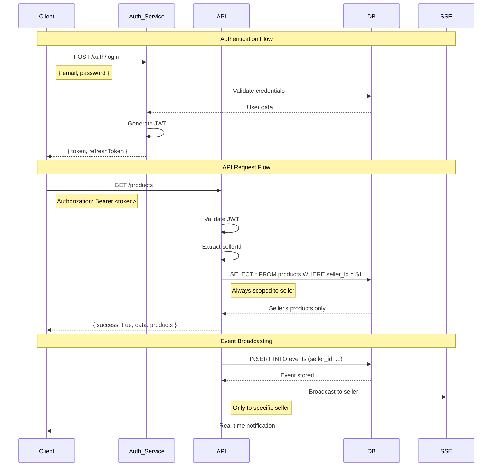
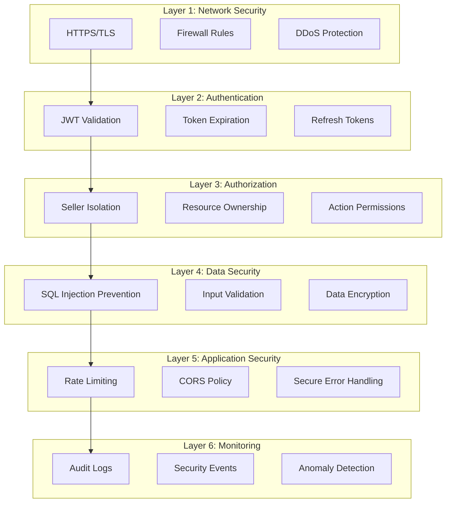
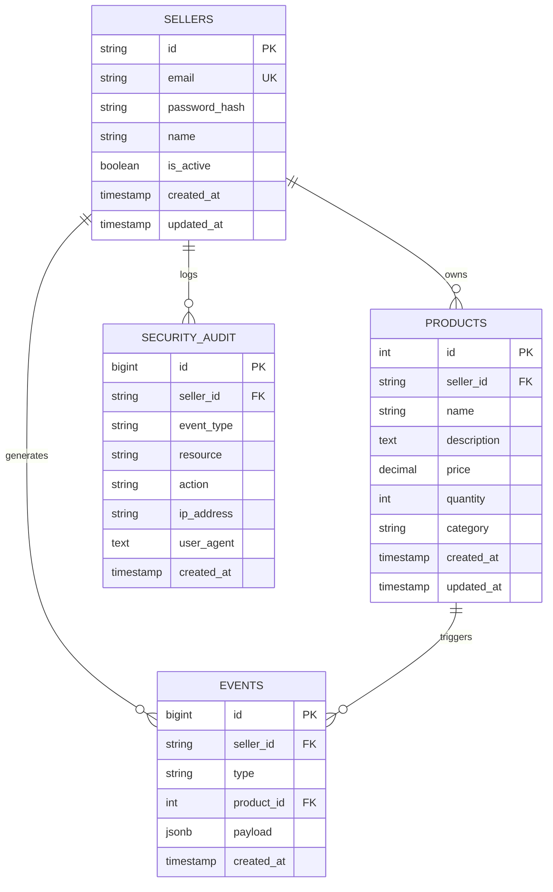

# System Architecture with Authentication

## High-Level Architecture with Auth Flow

## Authentication Flow Sequence

## Security Layers

## Database Security Model

## Implementation Status

### Implemented (Demo)
- [x] Basic seller context extraction
- [x] Query scoping by sellerId
- [x] Resource ownership validation
- [x] Event scoping to seller
- [x] Mock authentication middleware

### To Implement (Production)
- [ ] JWT token generation and validation
- [ ] User registration and login endpoints
- [ ] Password hashing and storage
- [ ] Token refresh mechanism
- [ ] Row-level security in PostgreSQL
- [ ] Security audit logging
- [ ] Rate limiting and DDoS protection

### Security Checklist
- [ ] HTTPS enforcement
- [ ] Secure token storage
- [ ] Input validation and sanitization
- [ ] SQL injection prevention
- [ ] CORS policy configuration
- [ ] Error message sanitization
- [ ] Security headers
- [ ] Audit trail implementation
- [ ] Monitoring and alerting
- [ ] Penetration testing

## Conclusion

This architecture ensures that:

1. **Authentication is properly handled** with JWT tokens
2. **Authorization is enforced** at multiple layers
3. **Seller isolation is maintained** throughout the system
4. **Security is built-in** from the ground up
5. **The system is production-ready** with proper security measures

The current demo implementation provides a solid foundation that can be extended to full authentication when needed.
